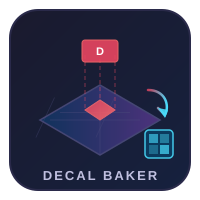

# DecalBaker

<p align="center">
  
</p>

<p align="center">
  
  
  
  
</p>

An Unreal Engine 5.3+ editor plugin that **bakes deferred decals into mesh textures** for export to USD, FBX, and OBJ. Designed for the **Omniverse Connector to Isaac Sim** pipeline where runtime decals are lost during export.

## Requirements

- **Unreal Engine 5.3+**
- **DBuffer rendering mode enabled** (Project Settings > Rendering > DBuffer Decals)
- **Python Editor Script Plugin** (required for automation scripts — enable in Plugins > Scripting)

## Problem

UE deferred decals are a screen-space rendering effect -- they exist only at runtime and are invisible to any export pipeline. When exporting scenes via the Omniverse Connector to USD for NVIDIA Isaac Sim, all decals disappear.

## Solution

DecalBaker composites decal projections into the underlying mesh textures **before export**, so decals become part of the standard PBR material and survive any format conversion.

## Architecture

```
Discovery ──> UV Analysis ──> GPU Bake ──> Texture Export ──> Material Assignment
   │              │              │              │                    │
   │              │              │              │                    │
 Find decals   Check UV0     UV-space       Render target        Create new
 & affected    overlaps,     rendering:     to static            material with
 meshes via    fallback to   VS maps UVs    UTexture2D           baked textures
 OBB overlap   UV1 or gen    to clip space, assets               & assign to mesh
               new channel   PS projects
                             decal textures
```

## Features

- Bakes all PBR channels: BaseColor, Normal, Roughness, Metallic, Emissive, Opacity
- Handles overlapping UVs (auto-detects and resolves via lightmap UVs or UV generation)
- Scales to thousands of decals per scene
- Non-destructive with full revert capability
- Editor toolbar button + dockable settings panel
- Right-click context menu on selected actors
- Batch commandlet for CI/automation
- Omniverse Connector pre-export hook
- Incremental re-bake (only re-processes changed decals)

## Usage

### Editor UI

1. Open the panel: **Toolbar > Decal Baker** or **Window > Decal Baker**
2. Configure settings (resolution, UV strategy, output path)
3. Select meshes or choose "Bake All"
4. Click **Bake Selected** or **Bake All**
5. Preview results, then **Apply** or **Revert**

### Right-Click

Select actors in the viewport > **Right-click > Bake Decals to Textures**

### Commandlet

**Windows:**
```bash
UnrealEditor-Cmd.exe MyProject.uproject -run=DecalBaker \
    -map=/Game/Maps/Warehouse \
    -output=/Game/BakedDecals/ \
    -resolution=2048 \
    -uvstrategy=auto
```

**Mac:**
```bash
/Users/Shared/Epic\ Games/UE_5.3/Engine/Binaries/Mac/UnrealEditor \
    MyProject.uproject -run=DecalBaker \
    -map=/Game/Maps/Warehouse \
    -output=/Game/BakedDecals/ \
    -resolution=2048 \
    -uvstrategy=auto
```

**Linux:**
```bash
~/UnrealEngine/Engine/Binaries/Linux/UnrealEditor \
    MyProject.uproject -run=DecalBaker \
    -map=/Game/Maps/Warehouse \
    -output=/Game/BakedDecals/ \
    -resolution=2048 \
    -uvstrategy=auto
```

## Installation

1. Clone this repo into your project's `Plugins/` directory
2. Regenerate project files
3. Build the project

## Project Structure

```
DecalBaker/
├── Source/
│   ├── DecalBakerRuntime/    # Core bake logic (no editor deps)
│   ├── DecalBakerShaders/    # USF shaders + registration
│   └── DecalBakerEditor/     # UI, toolbar, commandlet, export hook
└── Tests/
    └── DecalBakerTests/      # Automation tests
```

## License

MIT
